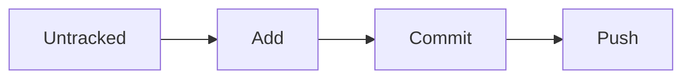
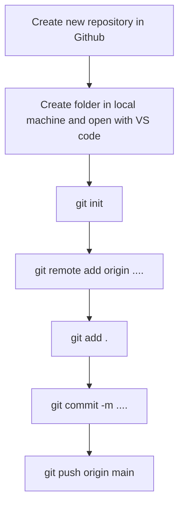

# Git and GitHub

###  Git
Version Control System is a tools that helps to track chnages in code.
Git is a **version Control** system

It is popular for 
- free and Open Source
- Fast and Scalable

It is used for track the history and collaborate.

### Github
Website that allows developers to store and manage their code using it.

https://github.com

#### Some Keywords

- Commit means change in github
- ~ it means you are in root directory

<div style= "height 400px; width 80%; background-color:green;border-radius:5px ">
<h3  style= "margin-left: 20px">Task</h3>
<p style= "margin-left: 10px">
1. Create a new respository
 <br>
2. Make our first commit
<p>

</div>

### Configuring Git

```
git config --global user.name "myname"
git config --global user.email "xyz@b.com"
git config --list
```


### Clone and Status 

<b>Clone</b> - Cloning on our local Machine
```
git clone <Link>
```
<b>Status</b> - Displays the state of the code
```
git status
```
M in VS code means - Modify

U in VS code means -Untracked

<div style= "height 100%; width 100%; background-color:purple;border-radius:5px">
<p style= "margin-left: 10px">
<b>Untracked</b> - New files that git donesn't yet track
<br>
<b>Modified </b> - Chnaged
<br>
<b>Staged</b> - Files is ready to be committed
<br>
<b>Unmodified</b> - Unchnaged </p>
</div>
<br>


~Quick Knownledge~

To Show all file in current directory
```
ls -a
```
### Add & Commit
<b>add</b> - Add new or changed files in your working directory to the git staging area.
```
git add <file name >
```
```
For adding all files in one

git add .
```

<b>commit</b> - It is the record of chnage
```
git commit -m "some massage"

here m for massage 
```

### Push Command

<b> push </b> - Upload local repo (folder/file) to remote repo

```
git push origin main

,here main is branch
```




### Init Command
<b>Init</b> - used to create a new git repo 

When we make a new folder then you have initilise it first.
```
git init
git remote add origin <link>
git remote -v (to verify remote)
git branch(to check branch)
git branch -M main(to rename branch)
git push origin main

git push -u origin main
here, u mean upstream you dont need to say again n again origin main.
so from the next time just use 

git push
```



### Git Branches


### Branch Commands
```
git branch  (to check branch)
git branch -M main (to renmae branch)
git checkout < branch name > (to navigate)
git checkout -b <new branch name > (to create new branch)

git branch -d <branch name > (to delete branch)

```
 ### Merging Code

 <h4> Way 1 </h4>


 ```
 git diff < branch name > (to compare , commits ,branches , files and more)

 git merge <Branch name > (to merge 2 branches)

 ```
 <h4> way 2</h4>

 to Create a pull request

 <b>Pull request </b> - It tells you others about chnges you 've pushed to a branch in a repositoey on Github.

 ### Pull command

 ```
 git pull origin main
 ```
 used to detch and download content from a remote repo and immediately update the local repo to match that content.

 ### Resolving Merge Conflicts

 An event that takes place when git is unable to automatically resolve differences in code between two commits.
 
 